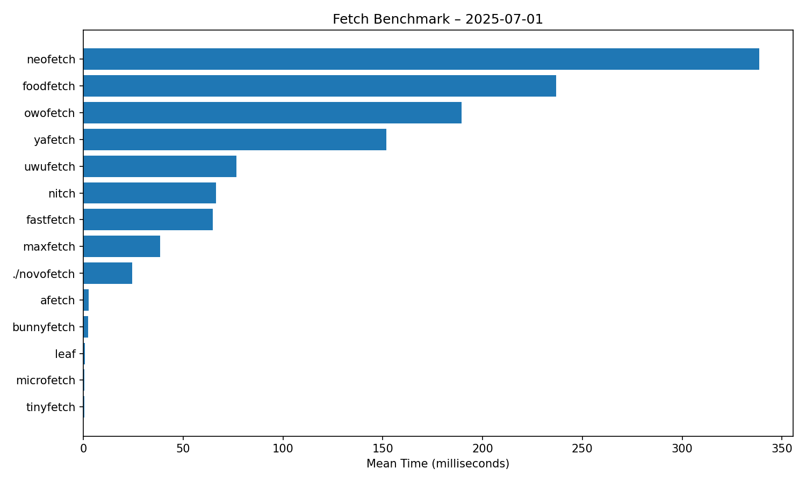

```
              _    __      ____     __       __
   ____  ____| |  / /___  / __/__  / /______/ /_
  / __ \/ __ \ | / / __ \/ /_/ _ \/ __/ ___/ __ \
 / / / / /_/ / |/ / /_/ / __/  __/ /_/ /__/ / / /
/_/ /_/\____/|___/\____/_/  \___/\__/\___/_/ /_/
```

A minimalist system fetch tool written in [V](https://vlang.io).
`novofetch` displays essential system information.

## Features

- OS and kernel info
- CPU and GPU models
- Memory usage
- Uptime
- User/host info
- Color palette preview

## Installation

### Prerequisites

- [V language](https://vlang.io) installed and available in your `$PATH` (for nix users, there is a flake for easy development)
- Unix-like OS (Linux, macOS) (i was too lazy to make windows support)

### Features

- `NO_COLOR` spec compliant
- Pretty fast
- Colorful
- Did I say it's fast?
- Looks good imo

### Clone and Build (or contribute)

```sh
git clone https://github.com/yehorovye/novofetch
cd novofetch
v -prod .
```

This will produce a binary called novofetch in the current directory.

### Usage
```
./novofetch [distro]
```

### Showcase


<!-- BENCHMARK:START -->
## Latest benchmark plot



<!-- BENCHMARK:END -->
